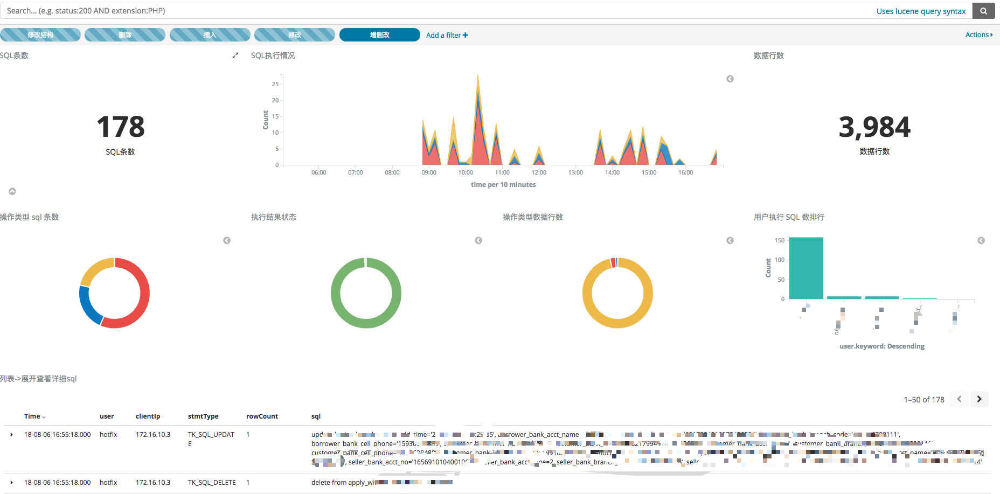

# 基于 mysql-proxy 的 SQL 日志代理


## 应用场景

在生产环境中，有一些意外的场景需要手动执行 sql, 然而 SQL 历史无法追溯

该方案可以用于 sql 的审计分析等场景


下面是使用 kibana 搭建的面板效果图




## 结构


```

   +-------+------+
   | mysql-client |
   +--------------+
           ^
           |
   +-------+-----+ sqllog.lua +---------+ read log file  +----------+ output +---------------+
   | mysql-proxy |----------->| sql.log |<---------------| logstash |------->| elasticsearch |
   +-------+-----+            +---------+                +----------+        +---------------+
           ^
           |
   +-------+------+
   | mysql-server |
   +--------------+
  
```

## 如何使用

* 修改 `docker-compose.yml` 中的 `MASTER_ADDRESSES` 为需要代理的数据库地址
* 修改 `config/logstash/pipline/logstash.conf` 中 output.elasticsearch 的地址为你需要的地址
* 运行 `./run.sh`

## 已知问题

* 基于 jdbc client 端，支持的最高版本为 `5.1.35` 
* 其他客户端未测试
